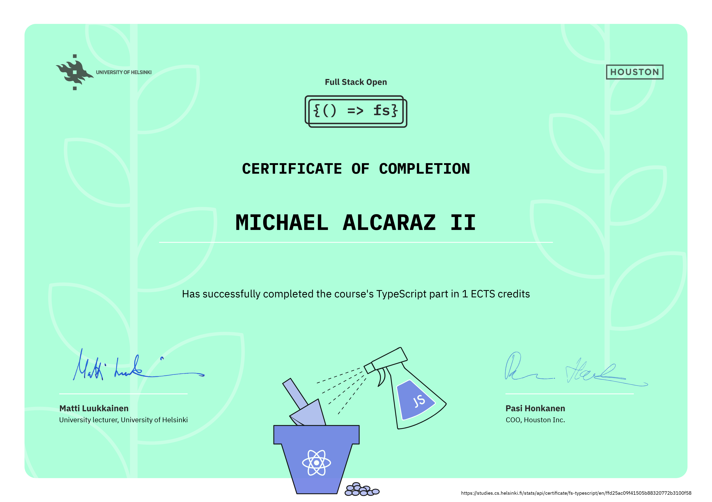

# [Full Stack Open 2023](https://fullstackopen.com/en/)

## About the course

Welcome to the Full Stack Open 2023, an immersive journey into modern web application development with JavaScript. This course primarily focuses on building single-page applications with ReactJS and utilizing REST APIs built with Node.js. Additionally, there's a dedicated section on GraphQL, a modern alternative to REST APIs.

The course covers essential aspects such as testing, configuration, environment management, and database usage for storing application data, among other things.

## Course Contents

### [Part 0 - Fundamentals of Web apps](https://github.com/Meimuri/fullstackopen/tree/main/part0)

-   General Info
-   Fundamentals of Web apps

### [Part 1 - Introduction to React](https://github.com/Meimuri/fullstackopen/tree/main/part1)

-   Introduction to React
-   JavaScript
-   Component State, event handlers
-   A more complex state, debugging React apps

### [Part 2 - Communicating with server](https://github.com/Meimuri/fullstackopen/tree/main/part2)

-   Rendering a collection, modules
-   Forms
-   Getting data from server
-   Altering data in server
-   Adding style to React apps

### [Part 3 - Programming a server with NodeJS and Express](https://github.com/Meimuri/fullstackopen/tree/main/part3)

-   Node.js and Express
-   Deploying app to internet
-   Saving data to MongoDB
-   Validation and ESLint

### [Part 4 - Testing Express servers, user administration](https://github.com/Meimuri/fullstackopen/tree/main/part4)

-   Structure of backend application, introduction to testing
-   Testing and backend
-   User administration
-   Token administration

### [Part 5 - Testing React apps](https://github.com/Meimuri/fullstackopen/tree/main/part5)

-   Login in frontend
-   props.children and proptypes
-   Testing React apps
-   End to end testing

### [Part 6 - State management with Redux](https://github.com/Meimuri/fullstackopen/tree/main/part6)

-   Flux-architecture and Redux
-   Many reducers
-   Communicating with server in a redux application
-   React Query, useReducer and the context

### [Part 7 - React router, custom hooks, styling app with CSS and webpack](https://github.com/Meimuri/fullstackopen/tree/main/part7)

-   React Router
-   Custom Hooks
-   More about styles
-   Webpack
-   Class components, Miscellaneous
-   Exercises: Extending the bloglist

### [Part 8 - GraphQL](https://github.com/Meimuri/fullstackopen/tree/main/part8)

-   GraphQL-server
-   React and GraphQL
-   Database and user administration
-   Login and updating the cache
-   Fragments and subscriptions

### [Part 9 - TypeScript](https://github.com/Meimuri/fullstackopen/tree/main/part9)

-   Background and Introduction
-   First steps with TypeScript
-   Typing an Express app
-   React with Types
-   Grande Finale: Patientor

### [Part 11 - CI/CD](https://github.com/Meimuri/fullstackopen/tree/main/part11)

-   Introduction to CI/CD
-   Getting started with GitHub Actions
-   Deployment
-   Keeping green
-   Expanding further

### [Part 12 - Containers](https://github.com/Meimuri/fullstackopen/tree/main/part12)

-   Introduction to Containers
-   Building and configuring environments
-   Basicas of Orchestration

### [Part 13 - Using Relational Databases](https://github.com/Meimuri/fullstackopen/tree/main/part13)

-   Using relational databases with Sequelize
-   Join tables and queries
-   Migrations, many-to-many relationships

## Certificate

### [Part 1 to 7](https://studies.cs.helsinki.fi/stats/api/certificate/fullstackopen/en/1a2210fbdf7707ebc1881a2fa306cb58)

### Part 8 - [GraphQL](https://studies.cs.helsinki.fi/stats/api/certificate/fs-graphql/en/0f18c8db4d473b9cf74da909a0ac8869)

### Part 9 - [TypeScript](https://studies.cs.helsinki.fi/stats/api/certificate/fs-typescript/en/ffd25ac09f41505b88320772b3100f58)

### Part 12 - [Containers](https://studies.cs.helsinki.fi/stats/api/certificate/fs-containers/en/938bf0358ffadf25b02d2705ce7f53c8)

### Part 13 - [Relational Databases](https://studies.cs.helsinki.fi/stats/api/certificate/fs-psql/en/656d265b73e2020c93883f069578eb8a)

## Authors

Parts 0-8 and 13 of the course material is written by [Matti Luukkainen](https://github.com/mluukkai). The content of part 9 is written by developers from [Terveystalo](https://www.terveystalo.com/fi/Yritystietoa/Terveystalo-tyontantajana/Digital-Health/). Part 10 is written by [Kalle Ilves](https://github.com/Kaltsoon). The content of part 11 is written by developers from [Smartly](https://www.smartly.io/) and part 12 is by [Jami Kousa](https://github.com/jakousa). Numerous [people](https://github.com/fullstack-hy2020/misc/blob/master/contributors.md) have improved and corrected the material both in content and spelling. You can also make improvements to the course material yourself.

The course webpage is designed and created by [Houston inc](https://www.houston-inc.com/), who have also audited the content of the course material. Chinese translation by [Zhang Wei](https://zhangwei.online/blog). Spanish translation by [Sebastian Torres](https://github.com/sebastiantorres86), [Cynthia Vico Vacca](https://github.com/cynthiamv) and [Pablo Maffioli](https://github.com/pablo-maff) with the support of [FrontendCafé](https://frontend.cafe/).

## License

The course material is licensed under [Creative Commons BY-NC-SA 3.0 license](https://creativecommons.org/licenses/by-nc-sa/3.0/), which means that you are free to use and distribute the material, as long as the names of the original authors are not removed. If you make changes to the material and want to distribute the modified version, it must be licensed under the same license. Using the material for commercial purposes is forbidden without permission.
